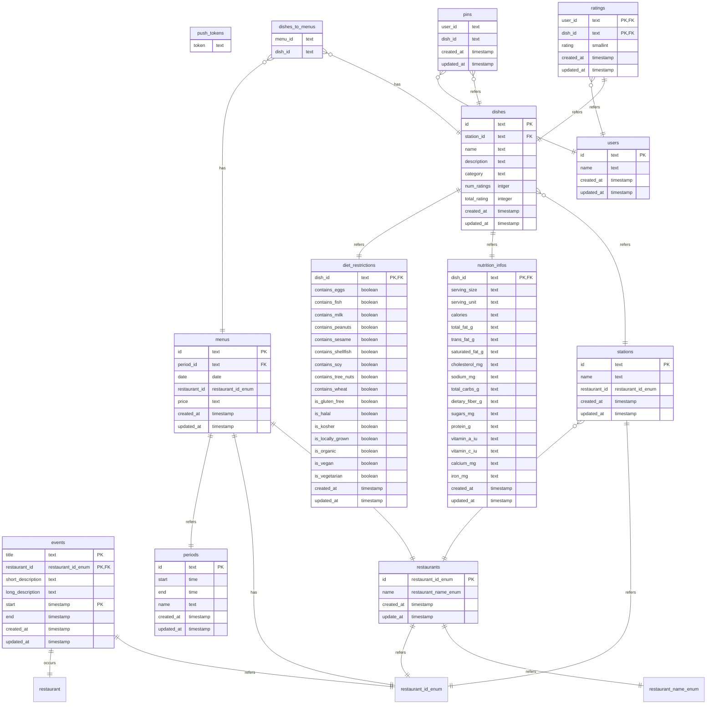

# PeterPlate

<pre style="color: green;">
 ███████████            █████                       ███████████  ████             █████            
▒▒███▒▒▒▒▒███          ▒▒███                       ▒▒███▒▒▒▒▒███▒▒███            ▒▒███             
 ▒███    ▒███  ██████  ███████    ██████  ████████  ▒███    ▒███ ▒███   ██████   ███████    ██████ 
 ▒██████████  ███▒▒███▒▒▒███▒    ███▒▒███▒▒███▒▒███ ▒██████████  ▒███  ▒▒▒▒▒███ ▒▒▒███▒    ███▒▒███
 ▒███▒▒▒▒▒▒  ▒███████   ▒███    ▒███████  ▒███ ▒▒▒  ▒███▒▒▒▒▒▒   ▒███   ███████   ▒███    ▒███████ 
 ▒███        ▒███▒▒▒    ▒███ ███▒███▒▒▒   ▒███      ▒███         ▒███  ███▒▒███   ▒███ ███▒███▒▒▒  
 █████       ▒▒██████   ▒▒█████ ▒▒██████  █████     █████        █████▒▒████████  ▒▒█████ ▒▒██████ 
▒▒▒▒▒         ▒▒▒▒▒▒     ▒▒▒▒▒   ▒▒▒▒▒▒  ▒▒▒▒▒     ▒▒▒▒▒        ▒▒▒▒▒  ▒▒▒▒▒▒▒▒    ▒▒▒▒▒   ▒▒▒▒▒▒  
</pre>

## About

Navigating UCI's dining options at Brandywine and the Anteatery is now simpler and more informed with PeterPlate. This comprehensive menu viewer, available as a website and mobile app, is designed to enhance your campus dining experience. UCI students use PeterPlate to plan their daily meals and track progress toward their nutritional goals.

Key features of PeterPlate include:

- **_Detailed Menu Viewer_**: Browse current and upcoming menus, allowing you 
to strategically plan your meal swipes and never miss your favorite dishes.
- **_Allergen and Dietary Information_**: Make informed choices with easy 
access to comprehensive ingredient and allergen details for every meal.
- **_Event Calendar_**: Stay updated on special dining hall events and limited-time offerings.
- **_Dish Ratings_**: Contribute your own feedback to help fellow Anteaters discover the best of campus dining.


## Technology

PeterPlate consists of a Next.JS frontend with a shared backend. A summary of the libraries used in each are listed below.

### Frontend

- [Next.js](https://nextjs.org) - Full-stack React framework used for the website.
- [shad/cn](https://ui.shadcn.com/) - A library of fully customizable, plug-n-play components for use with React.
- [Zustand](https://github.com/pmndrs/zustand) - State management library for React apps. 

### Backend
- [Drizzle](https://drizzle.dev/) - ORM for Postgres.
- [AWS](https://aws.amazon.com/) - RDS and Lambda.
- [Serverless Framework](https://www.serverless.com/) - Framework for cloud resources such as AWS Lambda.
- [tRPC](https://trpc.io/) - Typesafe remote procedure calls to access the underlying Postgres database.

### Tooling

- [Turborepo](https://turborepo.com) - High-performance build system for monorepo scaling.
- [Tailwind](https://tailwindcss.com) - A utility-first CSS framework.
- [TypeScript](https://www.typescriptlang.org) - JavaScript with type-checking.

### Schema ER Diagram



## Getting Started

### Pre-requisites

1. Install `Node.js`. This allows you to run JavaScript on your computer (outside of a browser).
   This is best done with a version manager that allows you to easily switch between
   Node.js versions based on the requirements of different projects.
   Try using any of the following.

   - [nvm](https://github.com/nvm-sh/nvm) - Node-Version-Manager.
   - [fnm](https://github.com/Schniz/fnm) - Fast-Node-Manager.
   - [nvm-windows](https://github.com/coreybutler/nvm-windows)

   If none of those work for any reason, you can defer to your Operating System's
   package manager or [the downloads from the official website](https://nodejs.org/en/download).
   We will be using the latest LTS version, 20.10.0, lts/iron.

2. Install `pnpm`. This is our package manager of choice for this project.
   It's responsible for installing, uninstalling, and keeping track of the app's dependencies.
   `npm install --global pnpm`

3. Make sure to have `docker` installed, which can be installed from [the official website](https://www.docker.com/get-started/). It will allow you to
   - run the local postgres database required for backend functions.
   - run backend tests that rely on Testcontainers.

### Developing

1. Clone the PeterPlate repository from GitHub.
   `git clone https://github.com/icssc/PeterPlate.git`

2. Navigate to the root directory and change your node version to the one specified in the .nvmrc by running 
   `nvm use` or `fnm use`. In particular, we will be using Node v20.
   
3. While still in the root directory and install the dependencies by running
   `cd PeterPlate && pnpm install`

4. To start a local Postgres container database run the `docker compose up` in the root directory.
   This will automatically set up and run a test database using docker.

5. Create a new file called `.env` based on the example given in `.env.development`

6. Run `pnpm db:push` to push the schema to the docker database.

7. Start local development by running `pnpm dev` in the root directory. This will start the server in `apps/server` and the client in `apps/next`.
   The tRPC procedures are available on <http://localhost:3000/><router.procedure\>?input={field: value}

   ```sh
   # example
   http://localhost:3000/events.get
   ```

8.  Pull the latest CampusDish data into your local database by `cd`'ing into the `apps/server` directory and running `pnpm run test:daily` or `pnpm run test:weekly`.

9.  View the local website at [http://localhost:8080](http://localhost:8080). As you make changes to the Next.js application, those changes will be automatically
reflected on the local website.

### Troubleshooting

Sometimes, you may run into errors when trying to run some of the commands listed above. Here are some things that can help fix this:

Reinstall packages
- Run `rm -force node_modules` and `pnpm install` to reinstall all packages in the project

Ensure Node is correct version
- Node v20 (latest of that version)
- Check by running `node -v`
- If not, download/switch to v20, by running:
   - `fnm install v20` or `nvm install v20`
   - `fnm use 20` or `nvm use 20`

### Testing

Run `npx turbo test` at the root of the project.

**Database**

Run the following commands to pull data into your local database. 

```sh
cd apps/server

# For daily test
pnpm test:daily

# For weekly test
pnpm test:weekly
```

If you want to check the contents of the database, run the following command in the root directory (while the server is not running).

```sh
pnpm db:studio
```

### Adding Workspaces

To add a new package run `turbo gen workspace` and follow the prompts.
