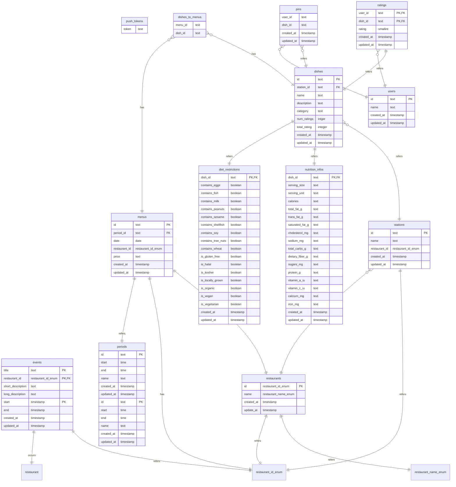

# ZotMeal

<pre style="color: green;">
__/\\\\\\\\\\\\\\\______________________________/\\\\____________/\\\\________________________________/\\\\\\____
 _\////////////\\\______________________________\/\\\\\\________/\\\\\\_______________________________\////\\\____
  ___________/\\\/_____________________/\\\______\/\\\//\\\____/\\\//\\\__________________________________\/\\\____
   _________/\\\/_________/\\\\\_____/\\\\\\\\\\\_\/\\\\///\\\/\\\/_\/\\\_____/\\\\\\\\___/\\\\\\\\\_______\/\\\____
    _______/\\\/_________/\\\///\\\__\////\\\////__\/\\\__\///\\\/___\/\\\___/\\\/////\\\_\////////\\\______\/\\\____
     _____/\\\/__________/\\\__\//\\\____\/\\\______\/\\\____\///_____\/\\\__/\\\\\\\\\\\____/\\\\\\\\\\_____\/\\\____
      ___/\\\/___________\//\\\__/\\\_____\/\\\_/\\__\/\\\_____________\/\\\_\//\\///////____/\\\/////\\\_____\/\\\____
       __/\\\\\\\\\\\\\\\__\///\\\\\/______\//\\\\\___\/\\\_____________\/\\\__\//\\\\\\\\\\_\//\\\\\\\\/\\__/\\\\\\\\\_
        _\///////////////_____\/////_________\/////____\///______________\///____\//////////___\////////\//__\/////////__
</pre>

## About

ZotMeal is a cross-platform React Native Expo application.
A summary of the libraries we use are listed below.

## Technology

### Frontend

- [Expo](https://expo.dev) - Universal framework for React Native.
- [Tamagui](https://tamagui.dev/) - Universal UI component library for React Native.

### Backend

- [Drizzle](https://drizzle.dev/) - ORM for Postgres.
- [AWS](https://aws.amazon.com/) - RDS and Lambda.
- [Serverless Framework](https://www.serverless.com/) - Framework for cloud resources such as AWS Lambda.
- [tRPC](https://trpc.io/) - Typesafe RPCs.

### Schema ER Diagram



## Getting Started

### Pre-requisites

1. Install `Node.js`. This allows you to run JavaScript on your computer (outside of a browser).
   This is best done with a version manager that allows you to easily switch between
   Node.js versions based on the requirements of different projects.
   Try using any of the following.

   - [nvm](https://github.com/nvm-sh/nvm) - Node-Version-Manager.
   - [fnm](https://github.com/Schniz/fnm) - Fast-Node-Manager.
   - [nvm-windows](https://github.com/coreybutler/nvm-windows)

   If none of those work for any reason, you can defer to your Operating System's
   package manager or [the downloads from the official website](https://nodejs.org/en/download).
   We will be using the latest LTS version, 20.10.0, lts/iron.

2. Install `pnpm`. This is our package manager of choice for this project.
   It's responsible for installing, uninstalling, and keeping track of the app's dependencies.
   `npm install --global pnpm`

3. Make sure to have `docker` installed, which can be installed from [the official website](https://www.docker.com/get-started/). It will allow you to
   - run the local postgres database required for backend functions.
   - run backend tests that rely on Testcontainers.

### Developing

1. Clone the ZotMeal repository or your fork.
   `git clone https://github.com/icssc/ZotMeal.git`

3. Change your node version to the one specified in the .nvmrc
   `nvm use` or `fnm use`. In particular, we will be using Node v20.
   
5. Navigate to the root directory and install the dependencies.
   `cd ZotMeal && pnpm install`

6. To start a local Postgres container database run the `docker compose up` in the root directory.
   This will automatically set up and run a test database using docker.

7. Create a new file called `.env` based on the example given in `.env.development`

8. Run `pnpm db:push` to push the schema to the docker database.

9. Start local development by running `pnpm dev` in `/apps/expo-rewrite` and `pnpm dev` in `/apps/server` (or `turbo dev` in the root directory).
   The tRPC procedures are available on <http://localhost:3000/><router.procedure\>?input={field: value}

   ```sh
   # example
   http://localhost:3000/events.get
   ```

10. View the local website at <http://localhost:8081> and/or with the [Expo Go mobile app](https://expo.dev/client).
   As you make changes to the Expo application, those changes will be automatically
   reflected on the local website as well as the mobile app.

### Troubleshooting

Sometimes, you may run into errors when trying to run some of the commands listed above. Here are some things that can help fix this:

Reinstall packages
- Run `rm -force node_modules` and `pnpm install` to reinstall all packages in the project

Ensure Node is correct version
- Node v20 (latest of that version)
- Check by running `node -v`

Clear expo cache
- Run `npx expo start -c` to clear the expo cache. This usually helps when `pnpm dev` gives an expo related error 

### Testing

Run `npx turbo test` at the root of the project.

**Database**

Run the following commands to pull data into your local database. 

```sh
cd apps/server

# For daily test
pnpm test:daily

# For weekly test
pnpm test:weekly
```

### Adding Workspaces

To add a new package run `turbo gen workspace` and follow the prompts
