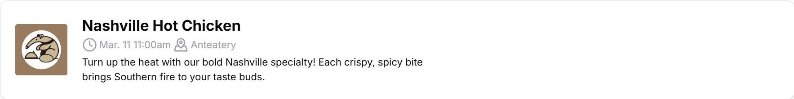

# The Nextjs Frontend

The other half of ZotMeal's frontend -- written in the [Next.js](https://nextjs.org) framework.

## Table of Contents
1. [App Structure](#app-structure)
    a. [📂 App](#-app)
    b. [📂 Components](#-components)
    c. [📂 Lib](#-lib)
3. [Backend Integration](#backend-integration)

# App Structure

The web app is contained in apps/next, which should look something like:

```
📦apps/next
 ┣ 📂.next
 ┣ 📂node_modules
 ┣ 📂public
 ┣ 📂src
 ┃ ┣ 📂app
 ┃ ┣ 📂components
 ┃ ┣ 📂lib
 ┃ ...
 ...
```

We will now go into detail about each subdirectory of `📂src`, where most of the work is done.

## 📂 App
In `📂app`, we use Next.js file router to establish **pages**, which are web pages rendered individually from one another, each with a unique URL.

```
📂app
 ┣ 📂about
 ┣ 📂events
 ┣ favicon.ico
 ┣ globals.css
 ┣ layout.tsx
 ┣ page.tsx
```

Without going too far into the weeds of the [Next.js page router](https://nextjs.org/docs/pages/building-your-application/routing/pages-and-layouts), let's breakdown each element:

- `📂about` & `📂events`: Each folder in Next (if containing a `page.tsx`) represents a page. In this case, `/about` and `/events`.
- `favicon.ico`: The favicon of the website (the little image that appears next to the tab name).
- `globals.css`: The global stylesheet for all pages, used by tailwindcss.
- `page.tsx`: The homepage for the web app.

## 📂 Components

All of the Next components used in ZotMeal's Nextjs web app are defined in `📂components`.

ZotMeal extends a lot of the [shad/cn](https://ui.shadcn.com/) library's components. As such, you may be better off looking at their documentation to implement your own component for ZotMeal.

See [Components](#components) for more details on each unique component.

## 📂 Lib

`📂lib` is largely empty (as of `v0.1 preview`), but there are plans to implement the backend integration functions (such as fetching with tRPC) in this folder.

# Components

## Contributor

|  |
| - |

### Summary
Contributor represents a contributor to the project. The images, user name, and link to their profile is directly pulled from [GitHub's developer API](https://docs.github.com/en/rest?apiVersion=2022-11-28).

Extends [Avatar](https://ui.shadcn.com/docs/components/avatar), [Hover Card](https://ui.shadcn.com/docs/components/hover-card).

### Props

| Prop Name | Prop Type | Summary |
| - | - | - |
| `name` | `string` | The actual name (not username) of the contributor. |
| `username` | `string` | The username of the contributor. |
| `profileSrc` | `string` | A URL to the profile picture of the contributor. |
| `bio` | `string` | The contributor's biography. |

## Event Card

| |
| - |

### Summary
Event Card represents a dining hall's upcoming event. This card is clickable, popping up [Event Dialog](#event-dialog).

Extends [Dialog](https://ui.shadcn.com/docs/components/dialog), [Card](https://ui.shadcn.com/docs/components/card).

### Props

| Prop Name | Prop Type | Summary |
| - | - | - |
| `name` | `string` | The name of the event.|
| `shortDesc` | `string` | A short (~120 character) description of the event.|
| `longDesc` | `string` | A full-length description of the event.|
| `imgSrc` | `string` | A URL to the image for the event. |
| `alt` | `string` | Alt text for the event's image. |
| `time` | `Date` | The start time of the event. |
| `location` | `EventLocation` (`enum`) | The binary (0 or 1) location of the event. See `EventLocation` defined in `event-card.tsx`.|

## Event Card Skeleton

|  |
| - |

### Summary
Represents a [Event Card](#event-card) that is still loading.

Extends [Skeleton](https://ui.shadcn.com/docs/components/skeleton), [Card](https://ui.shadcn.com/docs/components/card).

## Event Dialog

|  |
| - |

### Summary
A focused view of an event, incorporating a hero image, time and place, and long description. Auto-generates an "Add to Google Calendar" link based on `props`.

### Props
See [Event Card's props](#props-1).

## Food Card

|  |
| - |

### Summary
Food Card represents a dining hall's upcoming event. This card is clickable, popping up [Food Dialog](#food-dialog).

Extends [Dialog](https://ui.shadcn.com/docs/components/dialog), [Card](https://ui.shadcn.com/docs/components/card).

### Props

| Prop Name | Prop Type | Summary |
| - | - | - |
| `title` | `string` | The dish's name.|
| `description` | `string` | A short description of the dish.|
| `info` | `NutritionInfo` | The nutritional info of the dish. See `food-card.tsx` for specific fields.|
| `hallInfo` | `DiningHallInfo` | The hall and station where the dis is being served. See `food-card.tsx` for specific fields. |
| `imgSrc` | `string` | The URL of the dish's image. |
| `alt` | `string` | The alt text for the dish's image. |
| `rating` | `number` | A rating (1-5) of the dish. |
| `numRatings` | `number` | The number of ratings submitted for this dish. |

## Food Card Skeleton

|  |
| - |

### Summary
Represents a [Food Card](#food-card) that is still loading.

## Food Dialog


### Summary
A focused view of a dish, incorporating a hero image, nutritional info, and a description. Contains interactive elements [Rating Buttons](#rating-buttons) and [Pin Button](#pin-button).

### Props
See [Food Card props](#props-3).


## Rating Buttons
Not yet implemented.

## Pin Button
Not yet implemented.

# Backend Integration

| :bangbang: Backend Integration is not yet complete, so this section is constantly under revision.|
| - |