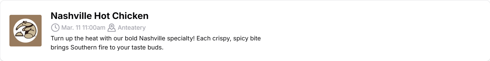
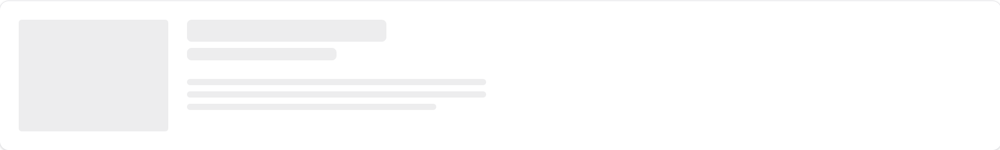
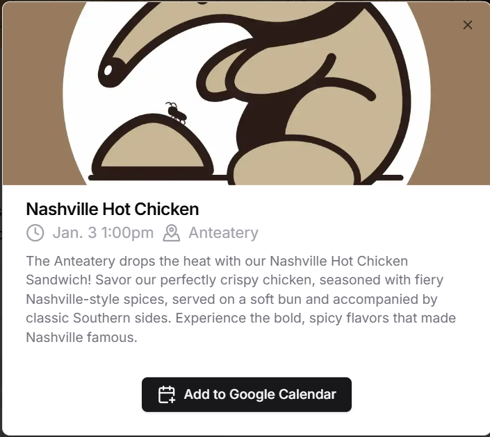
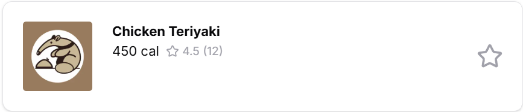
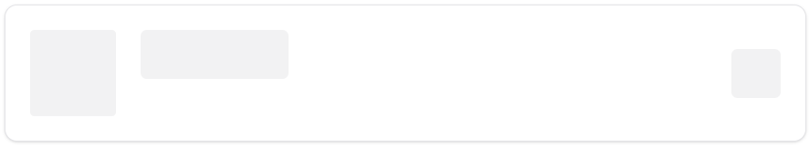
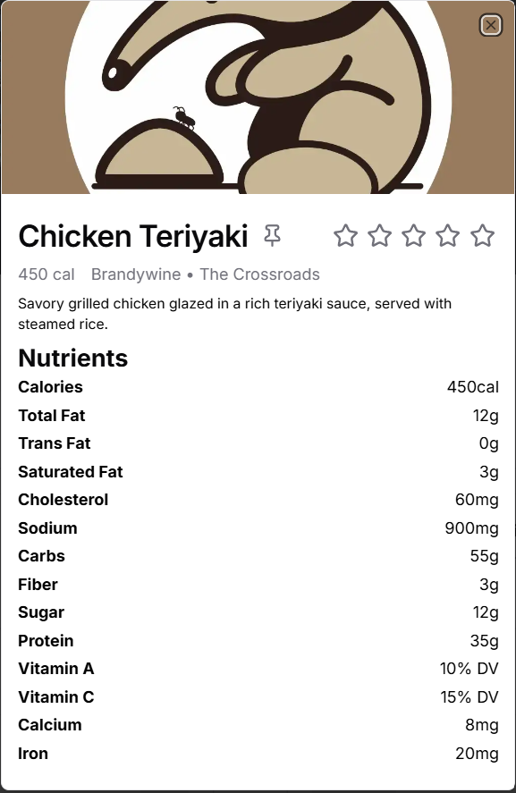

# The Frontend

PeterPlate's frontend -- written in the [Next.js](https://nextjs.org) framework.

## Table of Contents
1. [App Structure](#app-structure)
    a. [📂 App](#-app)
    b. [📂 Components](#-components)
    c. [📂 Context](#-context)
    d. [📂 Hooks](#-hooks)
    e. [📂 Utils](#-utils)
2. [Components Breakdown](#components)
2. [Backend Integration](#backend-integration)

# App Structure

The web app is contained in apps/next, which should look something like:

```
📦apps/next
 ┣ 📂.next
 ┣ 📂node_modules
 ┣ 📂public
 ┣ 📂src
 ┃ ┣ 📂app
 ┃ ┣ 📂components
 ┃ ┣ 📂context
 ┃ ┣ 📂hooks
 ┃ ┗ 📂utils
 ...
```

> A quick aside about `📂node_modules` and `📂public`: 
> - `📂public` is for static data that needs serving, like images.
> - `📂node_modules` is a folder that Node.js automatically generates for the packages used in development.

We will now go into detail about each subdirectory of `📂src`, which 
comprise the whole of the frontend.

## 📂 App
In `📂app`, we use Next.js file router to establish **pages**, which are web 
pages rendered individually from one another, each with a unique URL.

```
📂app
 ┣ 📂about
 ┣ 📂events
 ┣ favicon.ico
 ┣ globals.css
 ┣ layout.tsx
 ┣ page.tsx
```

Without going too far into the weeds of the [Next.js page router](https://nextjs.org/docs/pages/building-your-application/routing/pages-and-layouts), 
let's breakdown each element:

- `📂about` & `📂events`: Each folder in Next (if containing a `page.tsx`) 
represents a page. In this case, `/about` and `/events`.
- `favicon.ico`: The favicon of the website (the little image that appears 
next to the tab name).
- `globals.css`: The global stylesheet for all pages, used by tailwindcss.
- `page.tsx`: The homepage for the web app.

## 📂 Components

All of the components used in PeterPlate's web app are defined in 
`📂components`.

PeterPlate extends a lot of the [shad/cn](https://ui.shadcn.com/) library's 
components. As such, you may be better off looking at their documentation to 
implement your own component for PeterPlate.

See [Components](#components) for more details on each unique component.

## 📂 Context

All of the [contexts](https://react.dev/learn/passing-data-deeply-with-context)
used in PeterPlate's webapp are defined in `📂context`.

Essentially, a context is a method of passing information between components
without having to **prop drill**, or pass props deeply into children that may
or may not use those props. See the link above for React context information.

## 📂 Hooks

All of the [hooks](https://react.dev/reference/react/hooks) used in PeterPlate's
webapp are defined in `📂hooks`.

See the link above for more information on React hooks.

## 📂 Utils

Functions, types, constants, and other static information/tools used across
PeterPlate's webapp are defined in `📂utils`.

## Defining Your Own Folder

If for some reason you find yourself writing a file that doesn't fit within the
predefined folders above, please reach out to a current PeterPlate lead to figure
out whether a new folder needs to be created for organization. 

# Components
## Contributor

|  |
| - |

### Summary
Contributor represents a contributor to the project. The images, user name, and link to their profile is directly pulled from [GitHub's developer API](https://docs.github.com/en/rest?apiVersion=2022-11-28).

Extends [Avatar](https://ui.shadcn.com/docs/components/avatar), [Hover Card](https://ui.shadcn.com/docs/components/hover-card).

### Props

| Prop Name | Prop Type | Summary |
| - | - | - |
| `name` | `string` | The actual name (not username) of the contributor. |
| `username` | `string` | The username of the contributor. |
| `profileSrc` | `string` | A URL to the profile picture of the contributor. |
| `bio` | `string` | The contributor's biography. |

## Event Card

| |
| - |

### Summary
Event Card represents a dining hall's upcoming event. This card is clickable, popping up [Event Dialog](#event-dialog).

Extends [Dialog](https://ui.shadcn.com/docs/components/dialog), [Card](https://ui.shadcn.com/docs/components/card).

### Props

| Prop Name | Prop Type | Summary |
| - | - | - |
| `name` | `string` | The name of the event.|
| `shortDesc` | `string` | A short (~120 character) description of the event.|
| `longDesc` | `string` | A full-length description of the event.|
| `imgSrc` | `string` | A URL to the image for the event. |
| `alt` | `string` | Alt text for the event's image. |
| `time` | `Date` | The start time of the event. |
| `location` | `EventLocation` (`enum`) | The binary (0 or 1) location of the event. See `EventLocation` defined in `event-card.tsx`.|

## Event Card Skeleton

|  |
| - |

### Summary
Represents a [Event Card](#event-card) that is still loading.

Extends [Skeleton](https://ui.shadcn.com/docs/components/skeleton), [Card](https://ui.shadcn.com/docs/components/card).

## Event Dialog

|  |
| - |

### Summary
A focused view of an event, incorporating a hero image, time and place, and long description. Auto-generates an "Add to Google Calendar" link based on `props`.

### Props
See [Event Card's props](#props-1).

## Food Card

|  |
| - |

### Summary
Food Card represents a dining hall's upcoming event. This card is clickable, popping up [Food Dialog](#food-dialog).

Extends [Dialog](https://ui.shadcn.com/docs/components/dialog), [Card](https://ui.shadcn.com/docs/components/card).

### Props

| Prop Name | Prop Type | Summary |
| - | - | - |
| `title` | `string` | The dish's name.|
| `description` | `string` | A short description of the dish.|
| `info` | `NutritionInfo` | The nutritional info of the dish. See `food-card.tsx` for specific fields.|
| `hallInfo` | `DiningHallInfo` | The hall and station where the dis is being served. See `food-card.tsx` for specific fields. |
| `imgSrc` | `string` | The URL of the dish's image. |
| `alt` | `string` | The alt text for the dish's image. |
| `rating` | `number` | A rating (1-5) of the dish. |
| `numRatings` | `number` | The number of ratings submitted for this dish. |

## Food Card Skeleton

|  |
| - |

### Summary
Represents a [Food Card](#food-card) that is still loading.

## Food Dialog



### Summary
A focused view of a dish, incorporating a hero image, nutritional info, and a description. Contains interactive elements [Rating Buttons](#rating-buttons) and [Pin Button](#pin-button).

### Props
See [Food Card props](#props-3).


## Rating Buttons
Not yet implemented.

## Pin Button
Not yet implemented.

# Backend Integration

PeterPlate leverages a tRPC backend, which queries a local Postgres database. 
This database has cron jobs run on it that pull CampusDish data daily and weekly for dishes and events.

Most of the tRPC calls in the frontend (as of writing) are performed in the `side.tsx` file (Side component). For more information on the tRPC functions, check out `docs/Serverless Functions.md`, `docs/tRPC Procedures`, and the `packages/api/src` folder.